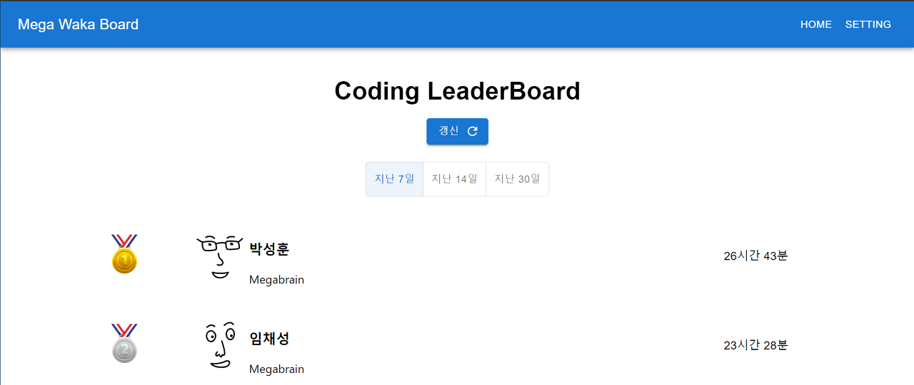
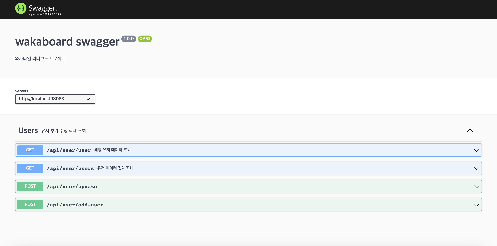
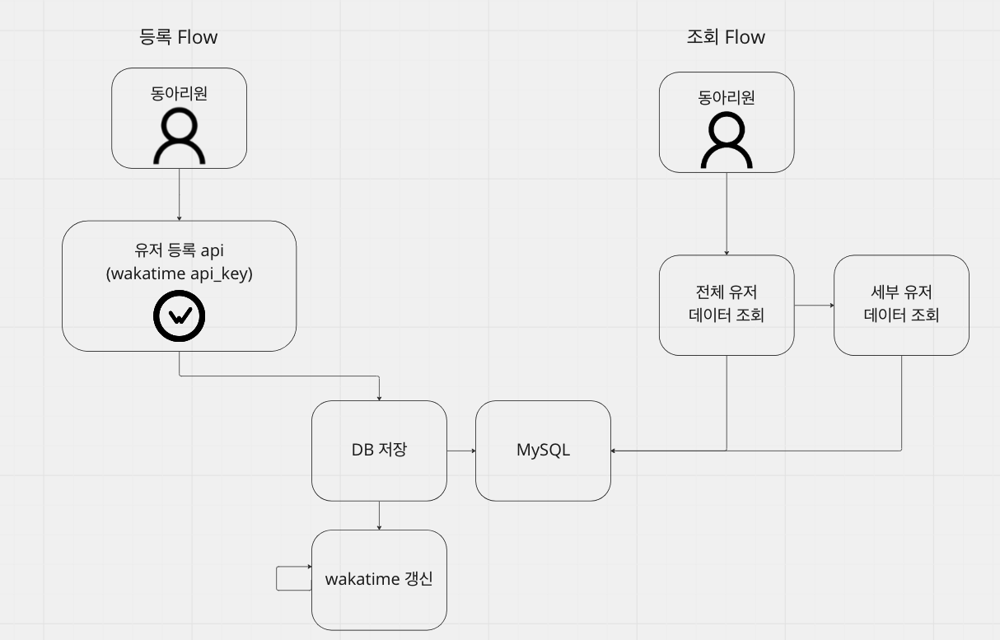

 

  <h1 align="center">메가브레인 와카타임 대시보드 Front-End</h3>

  

    
     
     
    <strong>Skill: Typescript, React, Material-UI, Emotion, Docker	</strong>

  

 
 

## About The Project

wakatime 서비스는 개발 시간 측정 서비스로 각 개발 ide 플러그인으로 구현 되어있습니다. 메가브레인 동아리에서 모든 동아리원이 플러그인을 적용하여 매주 얼마나 개발을 했는지 확인 용도로 서비스를 사용하고 있었습니다.

매번 불편하게 discord에 캡쳐 해서 상황을 보여주는 방식 대신 leader board를 만들어 개발 정보를 한 눈에 볼 수 있도록 개발 되었습니다.

[자세한 내용 보러 가기](https://www.jongung.com/288)

 

### Front View

 

### Swagger

 

### Flow

[등록 Flow]

1. 동아리 회원이 웹 사이트에 접속한다.
2. 등록 페이지에서 wakatime api key를 등록한다.
3. id와 이름, api key를 db에 저장한다.

[조회 Flow]

1. 동아리 회원이 웹 사이트에 접속한다.
2. 전체 유저 조회 api를 호출하여 유저 데이터를 볼 수 있다.
3. 세부 유저 페이지에서 각 유저 정보 조회를 통해 세부 유저 데이터를 볼 수 있다.

